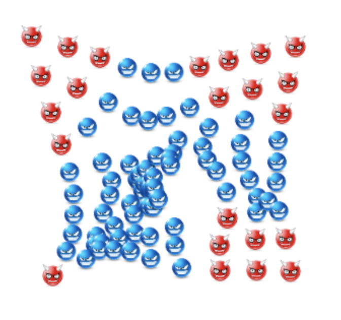
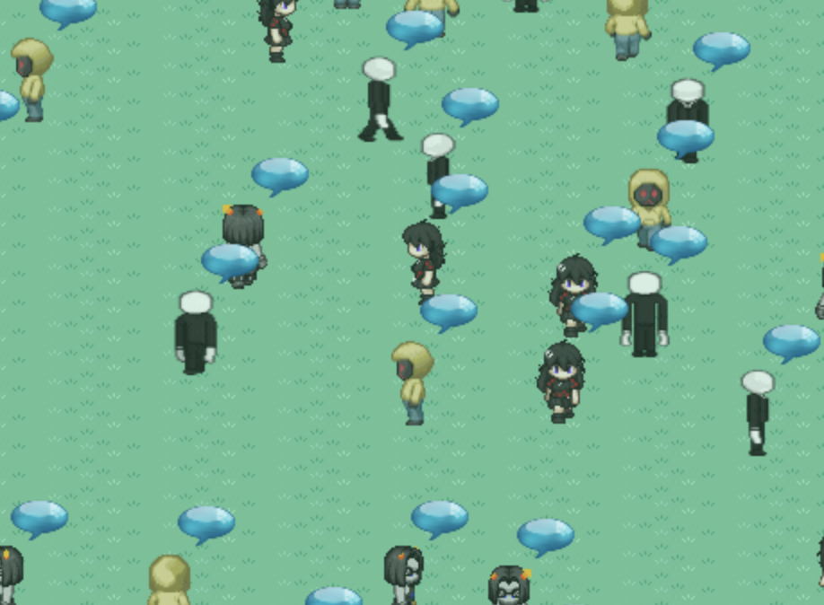

# Jasper2d - A Javascript 2d Game Engine

# How to use
- http://malfusion.github.io/JasperEngine-2D
# Demo
### Zombies (Click and hold to repel, watch the demons get infected by the zombie virus when they too close)
</img>
[Go to Demo](http://malfusion.github.io/JasperEngine-2D/tests/index8.html)
### Park (Example of a game area larger than the viewport area, move mouse to pan, humans bump against each other)
</img>
[Go to Demo](http://malfusion.github.io/JasperEngine-2D/tests/sample1.html)

## Architecture:
- The engine is based on two concepts.
Jasper 2D, an object-behavior based game engine that allows game devs to share their custom defined behaviors among other game developers to provide a new social aspect towards gaem development.

### How it works
- Jasper 2D consists of two main components:

### Objects
- Objects in Jasper have a logical existence.
- They do not have any behavior associated with them initially.
- They can be tagged with a name for reference.
- In short,
  - An Object is a logical entity and can be composed of any number of Behaviors

### Behaviors
- Behaviors give character to an object.
- They define an object, how it looks, what it does, how it does it, how it handles events, etc.
- In short,
  - A Mix of Behaviors Define an Object in the game.

#### Example
```javascript
var hero = new Jasper.Object("hero");   
hero.addBehavior("moveAround");
```
